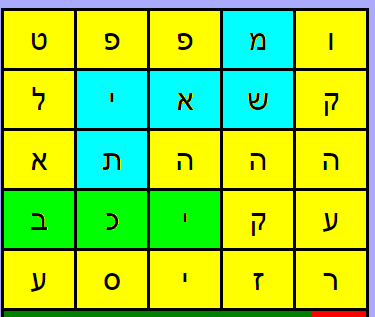
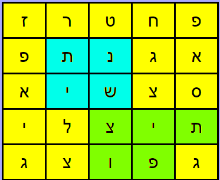
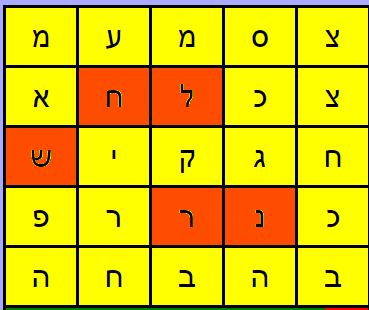

# מירוץ מילים (Boggle) - הוראות המשחק

ברוכים הבאים למדריך המלא למשחק **מרוץ מילים**. המטרה היא למצוא כמה שיותר מילים בלוח אותיות אקראי בזמן קצוב.

---

## 🎮 חוקי הבסיס (איך משחקים)

### מטרת המשחק
לצבור את מירב הנקודות על ידי מציאת מילים ייחודיות בלוח האותיות לפני תום הזמן שהוקצב (בדרך כלל 3 דקות).

### בניית מילים
* **חיבור אותיות:** מילה נוצרת על ידי חיבור אותיות סמוכות בלוח. ניתן לנוע לכל הכיוונים: למעלה, למטה, ימינה, שמאלה או לפי תנועת הזחל כמו במשחק  "סנייק" אך לא באלכסון.
* **שימוש באותיות:** מותר להשתמש בכל קוביית אות רק **פעם אחת** עבור מילה בודדת.
* **אורך מינימלי:** מילה תקנית חייבת להכיל לפחות **3 אותיות**.

### שלב הניקוד
בסיום הזמן, כל שחקן מקריא את רשימת המילים שלו:
1. **פסילת מילים משותפות:** מילה שמופיעה אצל יותר משחקן אחד נמחקת מהרשימות של כולם (0 נקודות).
2. **ניקוד מילים ייחודיות:** רק מילים שאף שחקן אחר לא מצא מזכות בנקודות לפי האורך שלהן:
   * **3 אותיות:** 1 נקודה
   * **4 אותיות:** 2 נקודות
   * **5 אותיות:** 3 נקודות
   * **6 אותיות:** 4 נקודות

וכן הלאה...
באופן כללי, חישוב הניקוד מתבצע לפי הנוסחה:

$$\text{ניקוד} = \text{אורך המילה} - 2$$

---

## 📝 דגשים וכללים נוספים

להלן הכללים המפורטים לגבי סוגי המילים המותרות והאסורות במשחק:

### ✅ מה מותר?
* מותר לרשום כל מילה בצורת **זכר או נקבה, יחיד או רבים**.
* מותר להשתמש ב**שמות עצם, שמות פעולה ובכל הטיות הזמן**.
* ניתן להשתמש ב**מילות סלנג**.
* **מילים בתוך מילים:** מותר ליצור מילים מתוך מילים אחרות (לדוגמה: מהמילה "סבלנות" ניתן להוציא גם "סבל" ו"לנו"). כל מילה תיספר בנפרד לניקוד הסופי.

### ❌ מה אסור?
* **מילים לועזיות** וראשי תיבות.
* צירופי מילים עם **מקף**.
* מילים המתחילות באותיות **בכל"מ** (לדוגמה: "ממחר", "כבקשתך").
* מילים עם **ה' הידיעה** (לדוגמה: "הכדור").
* מילים ב**סמיכות** (לדוגמה: "מסיבת").
* **שמות פרטיים או שמות מקומות** - אלא אם יש להם משמעות נוספת בעברית (לדוגמה: "נוגה" או "להבים").

### 💡 חשוב לזכור!
* **כפל משמעות:** מילה עם שתי משמעויות (כמו מֶלַח ומַלָּח) נחשבת למילה אחת בלבד לצורך הניקוד.
* **כפילויות בלוח:** מילה שמופיעה בכמה מקומות שונים על הלוח תיספר רק פעם אחת.
* **סוג כתיב:** מותר לכתוב מילים בכתיב **מלא** ו **חסר**.
* **טיפ:** חפשו מילים מורכבות ומיוחדות כדי להגדיל את הסיכוי שאחרים לא ימצאו אותן!

### 📋 דוגמאות למהלכים (הסברים על הלוח)

להלן הסברים על אופן בחירת המילים מתוך לוחות המשחק:

#### 1. חיבור משמאל לימין, במאוזן ובמאונך ומילה בתוך מילה:

בדוגמה זו ניתן לראות כיצד המילה **"משאית"** נוצרת במאוזן ובמאונך לפי כיוון "הזחל" , דבר המותר לפי החוקים.
כמו גם המילה "משא" כמילה בתוך מילה וכן המילה "בכי" משמאל לימין 

#### 2. הרכבת מילים, מילה בתוך מילה: 

ניתן להרכיב כמה מילים עם אותן אותיות כאשר כל אות מופיעה פעם אחת בכל מילה בודדת.
בדוגמה זו נמצאו המילים: **"נשית"**, **"נשי"**, **"תישן"** ו- **"נתיש"** כמילים נפרדות כאשר כל אות מופיעה פעם אחת בכל מילה בודדת
כמו כן ניתן להרכיב מילה בתוך מילה: כ 2 מילים נפרדות: **"צוף"** ו- **"צופית"**.

#### 3. מילים לא תקינות

הדוגמא מראה את המילה **"נר"** כמילה לא תקינה כיוון שזו בת 2 אותיות ואת המילה **"לחש"** שאינה תקינה אף היא כיוון שהיא באלכסון. 

---

## 🏆 המנצח

לפני תחילת המשחק, יש להחליט מראש כיצד ייקבע המנצח הסופי:

* **אפשרות 1:** השחקן שצבר את מירב הנקודות לאחר מספר סבבים מוגדר מראש.
* **אפשרות 2:** השחקן הראשון שמגיע ליעד נקודות שנקבע מראש (למשל, הראשון שהגיע ל-50 נקודות).

---
*בהצלחה במשחק!*
